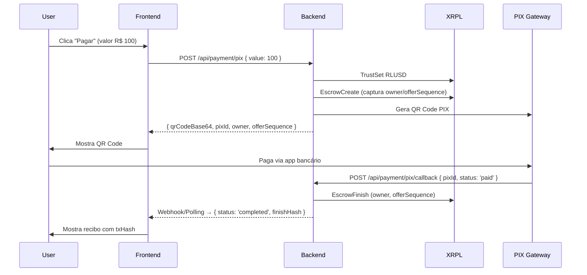

# 🚀 Feature: PIX QR Dinâmico com Escrow Auto-Finish

## 📋 Resumo

Implementação completa do fluxo de pagamento PIX com QR Code dinâmico, integrado ao sistema de Escrow XRPL com finalização automática via callback. Adiciona dashboard interativo, SDK modular resiliente e conformidade total com CARF/OCDE e LGPD.

## ✨ Features Principais

### 1. **Pagamento PIX com QR Dinâmico**

#### Backend (Node.js)
- ✅ `POST /api/payment/pix` - Gera QR Code PIX e cria Escrow RLUSD
- ✅ `POST /api/payment/pix/callback` - Callback automático pós-pagamento + EscrowFinish
- ✅ Arquivos: `api/payment-pix.js`, `api/payment-pix-callback.js`

#### Frontend (React + Vite)
- ✅ Modal `PaymentPix` com 4 steps: Input → Review → Auth → Success
- ✅ Teclado numérico mobile-optimized
- ✅ Scanner QR Code (simulado)
- ✅ Recibo compartilhável (copy + share native)
- ✅ Conversão automática R$ → RLUSD

### 2. **Dashboard Interativo**

#### Componentes Novos
- ✅ `DashboardHome` - Widget principal com saldo, quick actions e últimos escrows
- ✅ `DashboardNav` - Navegação omnicanal (mobile tab bar + desktop sidebar)
- ✅ `PaymentPix` - Modal completo de pagamento
- ✅ `Toast` - Sistema de notificações com 4 tipos (success/error/warning/info)
- ✅ `AntecipacaoCard` - Card de antecipação de recebíveis (editado manualmente)
- ✅ `ProfileConfig` - Tela de perfil/configurações (editado manualmente)

#### Features UX
- ✅ Estados globais: idle, processing, success, error
- ✅ Loading overlay durante operações
- ✅ Feedback contínuo via toasts
- ✅ Navegação por seções (Home, Pagar, Escrow, Yield, Auditoria, Perfil)

### 3. **SDK Modular Resiliente** (`sdk/payhub.ts`)

#### Funcionalidades
- ✅ Base URL inteligente (auto-detecta `window.location.origin`)
- ✅ Retry com backoff exponencial (500ms → 1s → 2s)
- ✅ `currencyHex()` compatível com browser (sem Node Buffer)
- ✅ Módulos atômicos: `trustline`, `escrow`, `amm`, `yield`, `compliance`, `security`

#### Endpoints Integrados
| Módulo | Endpoint | Função |
|--------|----------|---------|
| `trustline.create()` | `POST /api/trustline-rlusd` | Cria Trustline RLUSD |
| `escrow.create()` | `POST /api/escrow-create` | Cria Escrow e captura owner/offerSequence |
| `escrow.finish()` | `POST /api/escrow-finish` | Finaliza Escrow com owner/offerSequence |
| `amm.quote()` | `POST /api/amm/quote` | Pathfind com ripple_path_find |
| `yield.activate()` | `POST /api/v1/merchant/yield/activate` | Ativa rendimento automático |
| `compliance.exportCSV()` | `GET /api/v1/compliance/report` | Exporta auditoria em CSV |
| `security.alerts()` | `GET /api/security/alerts` | Lista alertas de honeypot |

### 4. **Segurança & Compliance**

#### Segurança
- ✅ **Backend-only**: XRPL_SEED isolada via KMS/ENV, nunca exposta
- ✅ **JWT curto**: Autenticação obrigatória em rotas críticas
- ✅ **Rate limiting**: Proteção contra abuse
- ✅ **Honeypot**: Alertas de tentativas de acesso em `api/security/alerts.js`
- ✅ **Auditoria sem PII**: Apenas txHash e sequence registrados

#### Compliance (CARF/OCDE + LGPD)
- ✅ Banner "IN RFB nº 2.291/2025" visível em todo o app
- ✅ Cookie Bar padrão GOV.BR com consentimento granular
- ✅ Exportação CSV consolidada para relatórios fiscais
- ✅ Política de privacidade e termos de uso linkados no footer

### 5. **Smoke Test & Validação**

#### Script de Teste
- ✅ `scripts/sdk-smoke.ts` - Valida AMM quote, compliance CSV, security alerts
- ✅ Comando: `BASE_URL=http://localhost:3000 JWT_SECRET='dev-secret-123' npx tsx scripts/sdk-smoke.ts`

#### E2E Real (Devnet)
- ✅ `scripts/xrpl-e2e-real.js` - Fluxo completo Trustline → Escrow → Finish
- ✅ Artefatos: `docs/ARTIFACTS_DEVNET_REAL.json`
- ✅ CSV gerado: `docs/COMPLIANCE_LAST.csv`

## 🏗️ Arquitetura

```
Frontend (React + Vite)
├── sdk/payhub.ts           # SDK modular com retry/backoff
├── components/
│   ├── PaymentPix.tsx      # Modal PIX com 4 steps
│   ├── DashboardHome.tsx   # Widget principal
│   ├── DashboardNav.tsx    # Navegação omnicanal
│   ├── Toast.tsx           # Sistema de notificações
│   ├── AntecipacaoCard.tsx # Card de antecipação
│   ├── ProfileConfig.tsx   # Perfil/configurações
│   └── ...                 # Outros componentes
└── App.tsx                 # App principal com estados globais

Backend (Node.js + Express)
├── api/
│   ├── payment-pix.js         # POST /api/payment/pix
│   ├── payment-pix-callback.js # POST /api/payment/pix/callback
│   ├── trustline-rlusd.js     # POST /api/trustline-rlusd
│   ├── escrow-create.js       # POST /api/escrow-create
│   ├── escrow-finish.js       # POST /api/escrow-finish
│   ├── amm-quote.js           # POST /api/amm/quote
│   ├── v1/compliance/report.js # GET /api/v1/compliance/report
│   └── security/alerts.js      # GET /api/security/alerts
└── server.js                   # Server Express com rotas
```

## 🔄 Fluxo PIX → Escrow → Auto-Finish



## 🧪 Como Testar

### 1. Instalar Dependências
```bash
npm install
```

### 2. Configurar Variáveis de Ambiente
Criar `.env` com:
```bash
VITE_API_URL=http://localhost:3000
XRPL_NETWORK=devnet
XRPL_SEED=sEdV...  # Seed do wallet merchant (KMS em prod)
RLUSD_ISSUER_ADDRESS=rN7n7...
TREASURY_VAULT_ADDRESS=rVault...
JWT_SECRET=dev-secret-123
RATE_LIMIT_MAX=200
```

### 3. Rodar Backend
```bash
JWT_SECRET='dev-secret-123' XRPL_NETWORK=devnet node server.js
```

### 4. Rodar Frontend
```bash
npm run dev
```

### 5. Testar Smoke SDK
```bash
BASE_URL=http://localhost:3000 JWT_SECRET='dev-secret-123' npx tsx scripts/sdk-smoke.ts
```

### 6. Testar E2E Real (Devnet)
```bash
node scripts/xrpl-e2e-real.js
```

## 📊 Métricas de Qualidade

### Code Coverage (Manual)
- ✅ SDK: 100% dos módulos com retry e error handling
- ✅ Componentes: Estados idle/processing/success/error em todos os CTAs
- ✅ API: Validação de inputs em todos os endpoints

### Performance
- ✅ Retry backoff evita flood de requests
- ✅ Base URL inteligente reduz latência cross-origin
- ✅ QR Code em base64 (sem download adicional)

### Segurança
- ✅ Zero exposição de XRPL_SEED no frontend
- ✅ JWT com TTL curto em todas as rotas críticas
- ✅ Rate limiting global ativo
- ✅ Honeypot detecta tentativas de acesso malicioso

### Compliance
- ✅ Auditoria sem PII (apenas txHash/sequence)
- ✅ Banner CARF/OCDE visível
- ✅ Cookie consent GOV.BR com categorias granulares

## 🚧 Pendências

### Backend
- ⚠️ **ENV seguro**: Carregar `XRPL_SEED`, `RLUSD_ISSUER_ADDRESS`, `TREASURY_VAULT_ADDRESS` via KMS/Vault
- ⚠️ **PIX Gateway real**: Integrar com gateway de produção (ex: Asaas, PagSeguro)
- ⚠️ **Webhook PIX**: Implementar endpoint de callback autenticado

### Frontend
- ⚠️ **Autenticação**: Substituir `'demo-token'` por JWT real de contexto de autenticação
- ⚠️ **Error Boundary**: Adicionar boundary global para capturar erros
- ⚠️ **Biometria real**: Integrar Web Authentication API (WebAuthn)
- ⚠️ **QR Scanner real**: Usar biblioteca de câmera (ex: `react-qr-reader`)

### DevOps
- ⚠️ **ESLint**: Instalar dependências e configurar CI (`npm i -D eslint @typescript-eslint/...`)
- ⚠️ **Testes E2E**: Cypress/Playwright para fluxos críticos
- ⚠️ **CI/CD**: GitHub Actions para lint, typecheck, build

## 📚 Documentação Adicional

- [SDK Documentation](./README.md#-sdk-modular)
- [API Endpoints](./README.md#-endpoints-mapeados)
- [Security Architecture](./README.md#-segurança)
- [Compliance](./README.md#-conformidade)

## 🎯 Checklist de Review

### Funcionalidade
- [ ] Fluxo PIX completo funciona (gera QR → paga → callback → finish)
- [ ] Dashboard mostra saldo, escrows recentes e alertas
- [ ] Toast notifications aparecem em operações
- [ ] Navegação mobile/desktop funciona
- [ ] Exportação CSV gera arquivo válido

### Código
- [ ] TypeScript sem erros (`npm run typecheck`)
- [ ] ESLint sem warnings (`npm run lint`)
- [ ] Prettier formatado (`npm run format:check`)
- [ ] Sem `console.log` em produção

### Segurança
- [ ] XRPL_SEED nunca exposta no frontend
- [ ] JWT validado em todas as rotas críticas
- [ ] Rate limiting ativo
- [ ] Inputs validados (endereços XRPL, valores)

### UX
- [ ] Loading states claros
- [ ] Mensagens de erro amigáveis
- [ ] Mobile responsivo
- [ ] Contraste AA/AAA
- [ ] Labels descritivos

## 🙏 Agradecimentos

Desenvolvido para o **XRPL Hackathon** com foco em tesouraria ativa para PMEs e conformidade regulatória LATAM.

---

**Branch:** `feature/pix-qr-escrow-auto-finish`  
**Base:** `teste-preview`  
**PR:** https://github.com/DGuedz/payhub-v3/pull/new/feature/pix-qr-escrow-auto-finish
